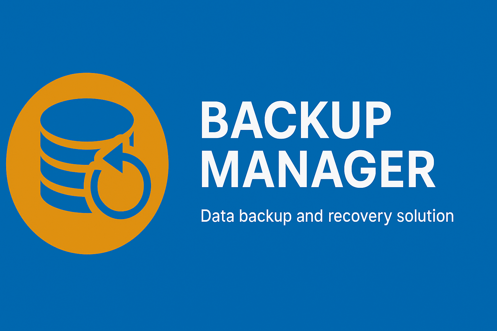

# Backup Manager

**Backup Manager** is a user-friendly program with an intuitive graphical interface, designed to simplify and automate the backup of folders and subfolders. Users can configure a custom time interval between automatic backups, setting the desired number of days between each operation. Additionally, manual backups can be performed at any time, providing maximum flexibility.

Each backup is carefully saved, and the program maintains a detailed log of all completed operations. Users can also view, manage, and edit the details of each backup, ensuring complete control and customization over saved data. This tool is an ideal solution for efficiently and securely protecting files, minimizing the risk of data loss.

## Features

* 📁 Automatic backup of folders and subfolders
* 🕒 Flexible scheduling for recurring backups
* 🖱️ Simple GUI with tray icon support
* 📝 Detailed logs and backup history
* 🎨 Light/Dark themes and multilingual support (EN, IT, DE, ES, FR)
* 🪟 Auto-start with the operating system (configurable)

## Screenshots and Videos

|  |  |
| ------------------------ | ------------------------ |
|  |  |

### Multi theme

|  |  |
| ------------------------ | ------------------------ |
|  | . |

## Code Ducumentation

$\rightarrow$ [Code tecnical documentation](./code_documentation.md)

## Important Notes

* If, for any reason, the setup program doesn't add the application to the startup registry (`regedit`), you can manually run "add_to_startup.bat" located in the installation folder by double-clicking it.
* This program is set to run automatically at PC startup by default. If you disable it, automatic backups will no longer occur.

## Platforms

| Platform | Availability |
| --- | --- |
| Windows | ✅ |
| Linux | ❌ |
| MacOS | ❌ |

## Supported Languages

| Piattaforma | Availability |
| --- | --- |
| English | ✅ |
| Italian | ✅ |
| Spanish | ✅ |
| German | ✅ |
| French | ✅ |

## Code Quality

This project enforces automatic code quality checks during the Maven verify phase.
Running the following command will execute formatting checks, static analysis, and tests:

`mvn clean verify`

If any rule is violated, the build will fail.

## Licence

## Time report

## Authors

* [DennisTurco](https://www.github.com/DennisTurco)

## Support

For support, email: [dennisturco@gmail.com](dennisturco@gmail.com)
