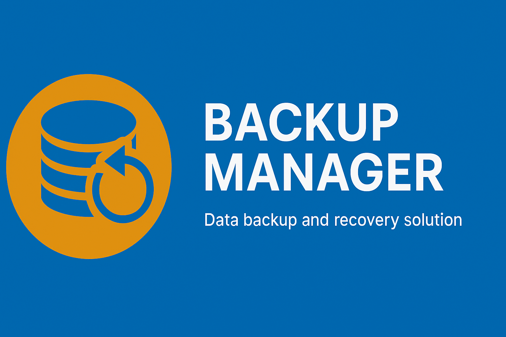
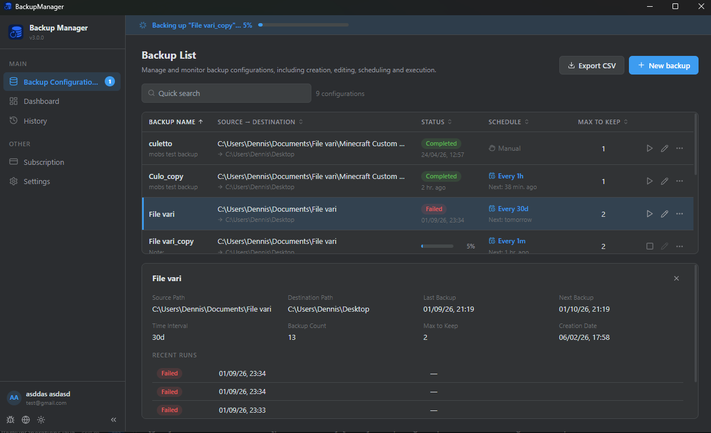
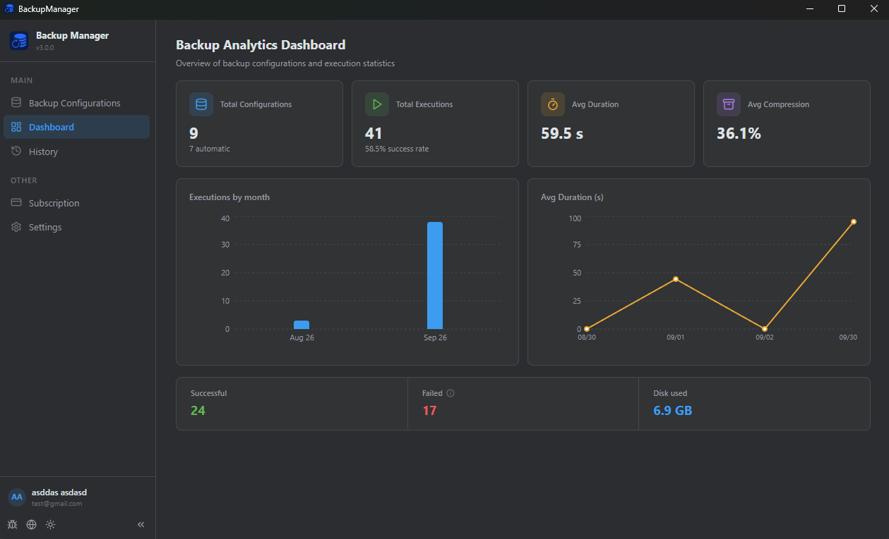
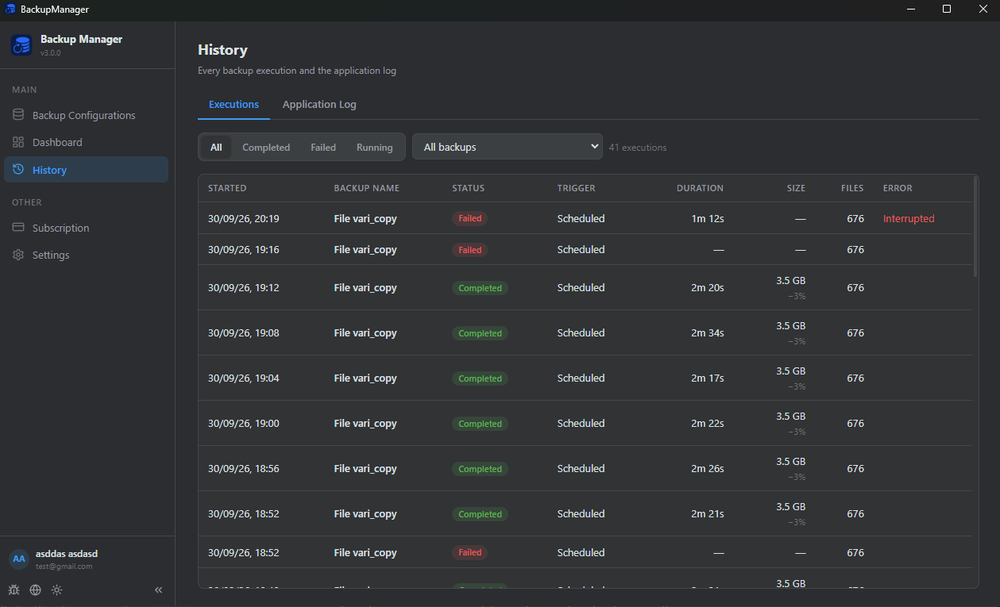
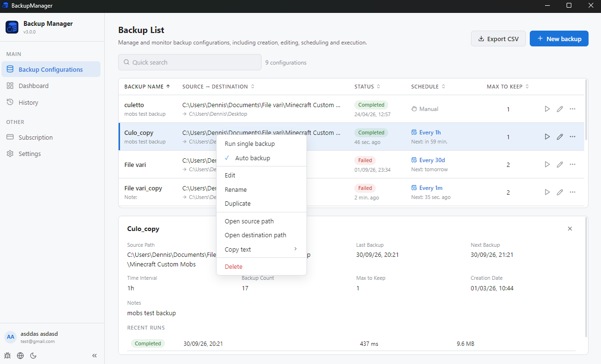

# Backup Manager

**Backup Manager** is a user-friendly program with an intuitive graphical interface, designed to simplify and automate the backup of folders and subfolders. Users can configure a custom time interval between automatic backups, setting the desired number of days between each operation. Additionally, manual backups can be performed at any time, providing maximum flexibility.

Each backup is carefully saved, and the program maintains a detailed log of all completed operations. Users can also view, manage, and edit the details of each backup, ensuring complete control and customization over saved data. This tool is an ideal solution for efficiently and securely protecting files, minimizing the risk of data loss.

## Features

* 📁 Automatic backup of folders and subfolders
* 🕒 Flexible scheduling for recurring backups
* 🖱️ Electron desktop app with tray icon support
* 📝 Detailed logs and backup history
* 🎨 Light/Dark themes and multilingual support (EN, IT, DE, ES, FR)

## Screenshots

|  |  |
| ------------------------ | ------------------------ |
|  |  |


## Architecture

**Runtime flow:** Electron spawns `java -jar BackupManager.jar --api-server` → Java starts Javalin REST server on `http://localhost:7089` → React renderer calls the API via Axios.

## Local Development Setup

### Prerequisites

| Tool | Version |
|------|---------|
| JDK  | 21+     |
| Maven | 3.9+   |
| Node.js | 20+  |
| npm  | 10+     |

### 1. Build the Java backend

```bash
mvn clean package -DskipTests
```

This produces `target/backupmanager-jar-with-dependencies.jar`.

### 2. Run the REST API server standalone (optional, for UI-only dev)

```bash
java -jar target/backupmanager-jar-with-dependencies.jar --api-server
```

The API will be available at `http://localhost:7089/api/status`. Keep this terminal open.

### 3. Start the React + Electron UI

```bash
cd ui
npm install
npm run dev
```

This opens Electron in development mode with hot-reload. `npm run dev` rebuilds the backend JAR first when the Java sources changed, then Electron spawns the Java backend (`spawnJavaBackend` in `src/main/index.ts`). If a backend is already answering on port 7089 (e.g. you started it in step 2 or from the IDE debugger), Electron reuses it instead of starting a second one.

### Simulating a first launch

```bash
cd ui
npm run dev:first-launch        # standard edition
npm run dev:first-launch:demo   # demo edition (subscription trial), like the demo installer
```

Starts the app against a throwaway home folder in `ui/.sandbox/` (recreated on every run): the backend gets a brand-new database, logs and Electron profile, so you see the first-run behaviour (new database, language detected from the PC, demo trial) without touching your real data in `Documents\Shard\data`. Add `-- --keep` to reuse the previous sandbox and test the second launch. Close any running BackupManager first: if a backend is already answering on port 7089 the app refuses to start instead of silently using your real database.

### 4. Build the Windows installer

```bash
# Build Java JAR first
./mvnw.cmd clean package -DskipTests

# Then package the Electron app (bundles the JAR and the JRE inside)
cd ui
npm run dist:win
```

Then compile `installer/BackupManager_installer.iss` (standard) or `installer/BackupManager_installer_demo.iss` (demo) with Inno Setup. Full guide: [docs/installer.md](./docs/installer.md).

### 5. Build the Linux and macOS installers

Run the "Build Linux installers" / "Build macOS installers" GitHub Actions manually (Actions tab > Run workflow); they also run on every push to `master` and upload the installers as workflow artifacts.

* **Linux** (AppImage + .deb): on a Linux machine put a Linux JRE in `jre-linux/` (e.g. `jlink --add-modules ALL-MODULE-PATH --strip-debug --no-man-pages --no-header-files --compress=zip-6 --output jre-linux`), build the JAR and run `npm run dist:linux` from `ui/`
* **macOS** (.dmg for Apple Silicon and Intel): on a Mac put the JREs in `jre-mac-arm64/` and `jre-mac-x64/` and run `npm run dist:mac` from `ui/`. The app is only ad-hoc signed (no Developer ID / notarization): on first launch right-click the app > Open

### Available npm scripts

| Script | Description |
|--------|-------------|
| `npm run dev` | Start Electron + Vite dev server with HMR |
| `npm run build` | Compile TypeScript + Vite bundle |
| `npm run preview` | Preview the built renderer in a browser |
| `npm run dist` | Build distributable (via electron-builder) |
| `npm run dist:win` | Package the Windows app into `release/win-unpacked` for the Inno Setup installer |
| `npm run dist:linux` | Build the Linux installers (AppImage + .deb) into `release/` (needs `jre-linux/`) |
| `npm run dist:mac` | Build the macOS installers (.dmg) into `release/` (needs `jre-mac-arm64/` and `jre-mac-x64/`) |

### Code quality — Java

```bash
mvn clean verify
```

Runs Checkstyle, SpotBugs and unit tests. The build fails on any violation.

## Code Documentation

$\rightarrow$ [Code technical documentation](./code_documentation.md)

## Important Notes

* The Java backend is fully headless — it has no window of its own and no standalone `.exe`. It's always launched by the Electron app (`spawnJavaBackend` in `ui/src/main/index.ts`), which also owns the tray icon.
* Automatic backups only run while the Electron app is running (in the tray or foreground). The Windows installer adds a per-user "start with Windows" entry (selected by default) that launches the app hidden in the tray. On Linux and macOS the app adds the equivalent entry itself on its first launch (`~/.config/autostart/backupmanager.desktop` / login item); remove it from the system's startup apps to disable it.

## Platforms

| Platform | Availability |
| --- | --- |
| Windows | ✅ |
| Linux | ✅ (via Electron) |
| MacOS | ✅ (via Electron) |

### Installing on Linux

* **Ubuntu, Debian, Mint and derivatives**: download the `.deb` and install it with a double click, or with `sudo apt install ./BackupManager-<version>-amd64.deb`. BackupManager then appears in the applications menu.
* **Other distributions**: download the `.AppImage`, make it executable (`chmod +x BackupManager-<version>-x86_64.AppImage`) and run it.
  If it doesn't start and mentions `libfuse.so.2`, install FUSE 2: `sudo apt install libfuse2` (`libfuse2t64` on Ubuntu 24.04+), or the equivalent package of your distribution.

## Supported Languages

| Piattaforma | Availability |
| --- | --- |
| English | ✅ |
| Italian | ✅ |
| Spanish | ✅ |
| German | ✅ |
| French | ✅ |

## Code Quality

This project uses automated code quality analysis on every Pull Request targeting `master`.
The analysis runs the following tools and posts a summary comment directly on the PR:

| Tool | What it checks |
|------|---------------|
| JaCoCo | Test coverage (line & branch) |
| SpotBugs + find-sec-bugs | Bugs and security vulnerabilities |
| PMD | Code complexity and style violations |
| CPD | Code duplication (blocks > 100 tokens) |

To run the analysis locally:

```powershell
./analyze.ps1
```

Or run individual checks:

```powershell
./mvnw clean verify "-Dmaven.test.failure.ignore=true"   # tests + coverage
./mvnw spotbugs:spotbugs                                  # bug analysis
./mvnw pmd:pmd pmd:cpd                                    # complexity + duplication
```

## Licence

[](https://choosealicense.com/licenses/mit/)

## Time report

[](https://wakatime.com/badge/user/ce36d0fc-2f0b-4e85-b318-872804ab18b6/project/882e0afb-87a6-495d-9082-a9de9f9f4f19)

## Authors

* [DennisTurco](https://www.github.com/DennisTurco)

## Support

For support, email: [dennisturco@gmail.com](dennisturco@gmail.com)
