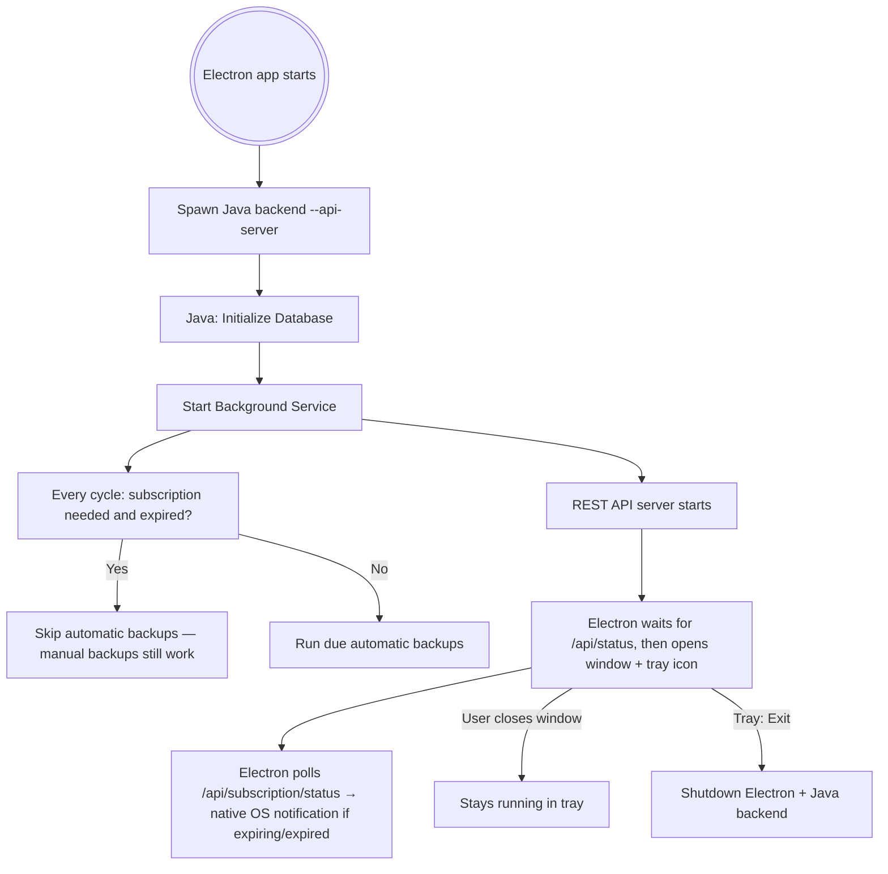

# Technical Documentation

## Application Startup Flow

The app is Electron-only: there is no Swing GUI or standalone `.exe` anymore. Electron always spawns the Java backend headless (`java -jar backupmanager-jar-with-dependencies.jar --api-server`) and owns the window + tray icon itself.


```mermaid
graph TD
  A(((Electron app starts))) --> B[Spawn Java backend --api-server]
  B --> C[Java: Initialize Database]
  C --> F[Start Background Service]
  F --> M[REST API server starts]

  F --> G[Every cycle: subscription needed and expired?]
  G -->|Yes| L[Skip automatic backups — manual backups still work]
  G -->|No| H[Run due automatic backups]

  M --> N[Electron waits for /api/status, then opens window + tray icon]
  N --> O[Electron polls /api/subscription/status → native OS notification if expiring/expired]
  N -->|User closes window| P[Stays running in tray]
  N -->|Tray: Exit| Q[Shutdown Electron + Java backend]
```

## Link

* [SVG](https://www.svgrepo.com/)

## Logging

The logging system currently used is **logback**. You can check the current configuration in [CONFIG](../logback.xml).
Logs are written both to:

* Console
* Rolling log files

### configuration

* We use "ROLLING_FILE" configuration
* Our configuration has the objective to change log file every day and keep the last 7 days of .log files:
  * During the current day, the active file will always be `logs/application.log`.
  * At midnight, the current file is renamed with the date (e.g., `application-2025-01-22.log`), and a new `application.log`  file is created.
* You can check if the current configuration works using `<configuration debug="true">`

### Enable and disable log levels

You can modify logging verbosity without changing the code by editing the `<root>` level inside `logback.xml`.

To dynamically change the log level, edit the level value in the `<root>` tag:

```xml
<root level="debug">
    <appender-ref ref="CONSOLE" />
    <appender-ref ref="FILE" />
</root>
```

* debug: Logs all messages (DEBUG, INFO, WARN, ERROR).
* info: Ignores DEBUG, logs only INFO, WARN, and ERROR.
* warn: Ignores DEBUG and INFO, logs only WARN and ERROR.
* error: Logs only ERROR.

## Threads & Background Workers

### [BackgroundService](../../java/backupmanager/Services/BackgroundService.java)

This service starts automatically when the Electron app (and its Java backend) starts.

Responsibilities:

* Execute scheduled automatic backups
* Run periodic backup checks
* Prevent concurrent backup executions

### How the React UI stays in sync with running backups

There is only ever one Java process (the API server), so there is no multi-instance state to reconcile like there used to be with the Swing GUI + background service running as separate processes. The React frontend polls `GET /api/backups/running` (backed directly by the `BackupRequests` table) every second while a backup is in progress, so the progress bar and table state always reflect the database, not any in-memory UI state.

## Subscription logic

Backup Manager includes a lightweight subscription system used to control access to automatic backup features without introducing unnecessary architectural complexity.

### Goals

By default the Subscription is set to `false`.
To turn it on, a manual update on the "Configurations" table is required.

The subscription mechanism is designed to be:

* Simple to validate
* Offline-friendly
* Database-driven
* Fail-safe

The application must always remain usable, even when the subscription expires.
Manual backups remain available regardless of subscription status.

### Expiration Warning

To improve user experience, Backup Manager warns the user 7 days before expiration.
This value is configurable and stored inside the application configuration.
When the threshold is reached:

* A native OS notification is shown by the Electron app (see `checkSubscriptionStatus` in `ui/src/main/index.ts`), polling `GET /api/subscription/status`.
* Automatic backups continue to function until the expiration date.

### Useful Queries

1. You can control the Subscription from the "Configurations" table.
   * To turn it on:

      ```sql
      UPDATE Configurations SET Value = 'True' WHERE Code = 'SubscriptionNedded';
      ```

   * To turn it off:

      ```sql
      UPDATE Configurations SET Value = 'False' WHERE Code = 'SubscriptionNedded';
      ```

2. To read from Subscriptions table, I suggest you to use the view:

    ```sql
    SELECT * FROM v_Subscriptions;
    ```

3. To create a subscription period you have to manually insert it, for instance:

    ```sql
    INSERT INTO Subscriptions (InsertDate, StartDate, EndDate, CreationType)
    VALUES (
        strftime('%s','now') * 1000,
        strftime('%s','2026-01-30 00:00:00') * 1000,
        strftime('%s','2026-12-30 00:00:00') * 1000,
        'MANUAL'
    );
    ```

## Architecture Philosophy

Backup Manager is intentionally designed to be:

* Lightweight
* Reliable
* Database-driven
* Minimal in external dependencies

The goal is to avoid enterprise-level complexity while maintaining production-grade stability.

## Build

To build the project: `mvn clean install`

## CI / Code Quality

### GitHub Actions Workflows

| Workflow | Trigger | Purpose |
|----------|---------|---------|
| `maven.yml` | Push to `master` | Fast build check (no tests) |
| `pr-analysis.yml` | Pull Request to `master` | Full code quality analysis |

### PR Analysis Workflow

On every PR, the pipeline runs four checks and posts a summary comment:

| Tool | What it checks | Output file |
|------|---------------|-------------|
| JaCoCo | Line and branch test coverage | `target/site/jacoco/jacoco.xml` |
| SpotBugs + find-sec-bugs | Static bugs and security vulnerabilities | `target/spotbugsXml.xml` |
| PMD | Cyclomatic complexity, code smells | `target/pmd.xml` |
| CPD | Duplicated code blocks (> 100 tokens) | `target/cpd.xml` |

If SpotBugs finds **high-severity** bugs, a GitHub Issue is opened automatically with labels `security`, `bug`, `automated`.

### Running Locally

```powershell
./analyze.ps1
```

Or step by step:

```powershell
./mvnw clean verify "-Dmaven.test.failure.ignore=true"   # tests + coverage
./mvnw spotbugs:spotbugs                                  # bugs + vulnerabilities
./mvnw pmd:pmd pmd:cpd                                    # complexity + duplication
./mvnw spotbugs:gui                                       # open SpotBugs visual report
```
