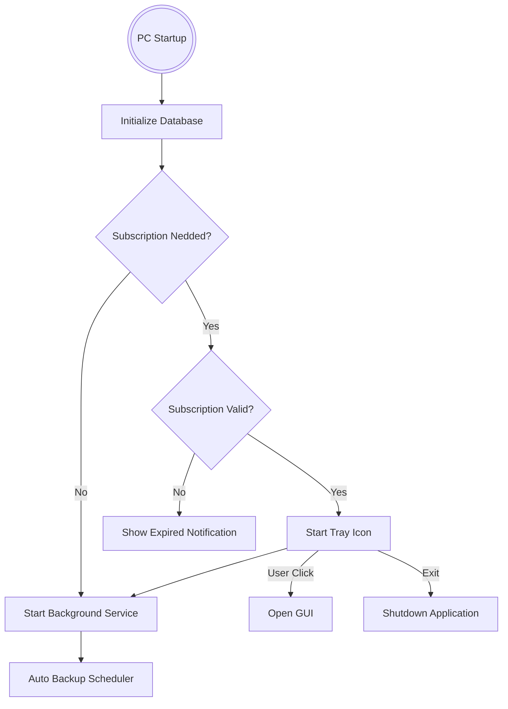

# Tecnical Documentation

## Application Startup Flow



## Link

* [SVG](https://www.svgrepo.com/)

## Logging

The logging system currently used is **logback**. You can check the current configuration in [CONFIG](../logback.xml).
Logs are written both to:

* Console
* Rolling log files

### configuration

* We use "ROLLING_FILE" configuration
* Our configuration has the objective to change log file every day and keep the last 7 days of .log files:
  * During the current day, the active file will always be `logs/application.log`.
  * At midnight, the current file is renamed with the date (e.g., `application-2025-01-22.log`), and a new `application.log`  file is created.
* You can check if the current configuration works using `<configuration debug="true">`

### Enable and disable log levels

You can modify logging verbosity without changing the code by editing the `<root>` level inside `logback.xml`.

To dynamically change the log level, edit the level value in the `<root>` tag:

```xml
<root level="debug">
    <appender-ref ref="CONSOLE" />
    <appender-ref ref="FILE" />
</root>
```

* debug: Logs all messages (DEBUG, INFO, WARN, ERROR).
* info: Ignores DEBUG, logs only INFO, WARN, and ERROR.
* warn: Ignores DEBUG and INFO, logs only WARN and ERROR.
* error: Logs only ERROR.

## Threads & Background Workers

### [BackgroundService](../../java/backupmanager/Services/BackgroundService.java)

This service starts automatically when the PC boots.

Responsibilities:

* Execute scheduled automatic backups
* Run periodic backup checks
* Prevent concurrent backup executions

### [BackupObserver](../../java/backupmanager/Services/BackupObserver.java)

This observer continuously monitors active backups.

Why is it necessary?

If a backup is triggered by the BackgroundService and the user later opens the GUI, two separate application instances may exist.

Because of this, a simple in-memory check is not reliable.

The observer ensures that:

* Running backups are detected
* The GUI reflects the real execution state
* Duplicate backups are prevented

## Subscription logic

Backup Manager includes a lightweight subscription system used to control access to automatic backup features without introducing unnecessary architectural complexity.

### Goals

By default the Subscription is setted to `false`.
To turn it on isrequired a manual update on "Configurations" table.

The subscription mechanism is designed to be:

* Simple to validate
* Offline-friendly
* Database-driven
* Fail-safe

The application must always remain usable, even when the subscription expires.
Manual backups remain available regardless of subscription status.

### Expiration Warning

To improve user experience, Backup Manager warns the user 7 days before expiration.
This value is configurable and stored inside the application configuration.
When the threshold is reached:

* A warning notification is displayed.
* Automatic backups continue to function until the expiration date.

### Useful Queries

1. You can cantrol the Subscription from the "Configurations" table.
   * To turn it on:

      ```sql
      UPDATE Configurations SET Value = 'True' WHERE Code = 'SubscriptionNedded';
      ```

   * To turn it off:

      ```sql
      UPDATE Configurations SET Value = 'False' WHERE Code = 'SubscriptionNedded';
      ```

2. To read from Subscriptions table, I suggest you to use the view:

    ```sql
    SELECT * FROM v_Subscriptions;
    ```

3. To create a subscription period you have to manually insert it, for instance:

    ```sql
    INSERT INTO Subscriptions (InsertDate, StartDate, EndDate)
    VALUES (
        strftime('%s','now') * 1000,
        strftime('%s','2026-01-30 00:00:00') * 1000,
        strftime('%s','2026-12-30 00:00:00') * 1000
    );
    ```

## Architecture Philosophy

Backup Manager is intentionally designed to be:

* Lightweight
* Reliable
* Database-driven
* Minimal in external dependencies

The goal is to avoid enterprise-level complexity while maintaining production-grade stability.
