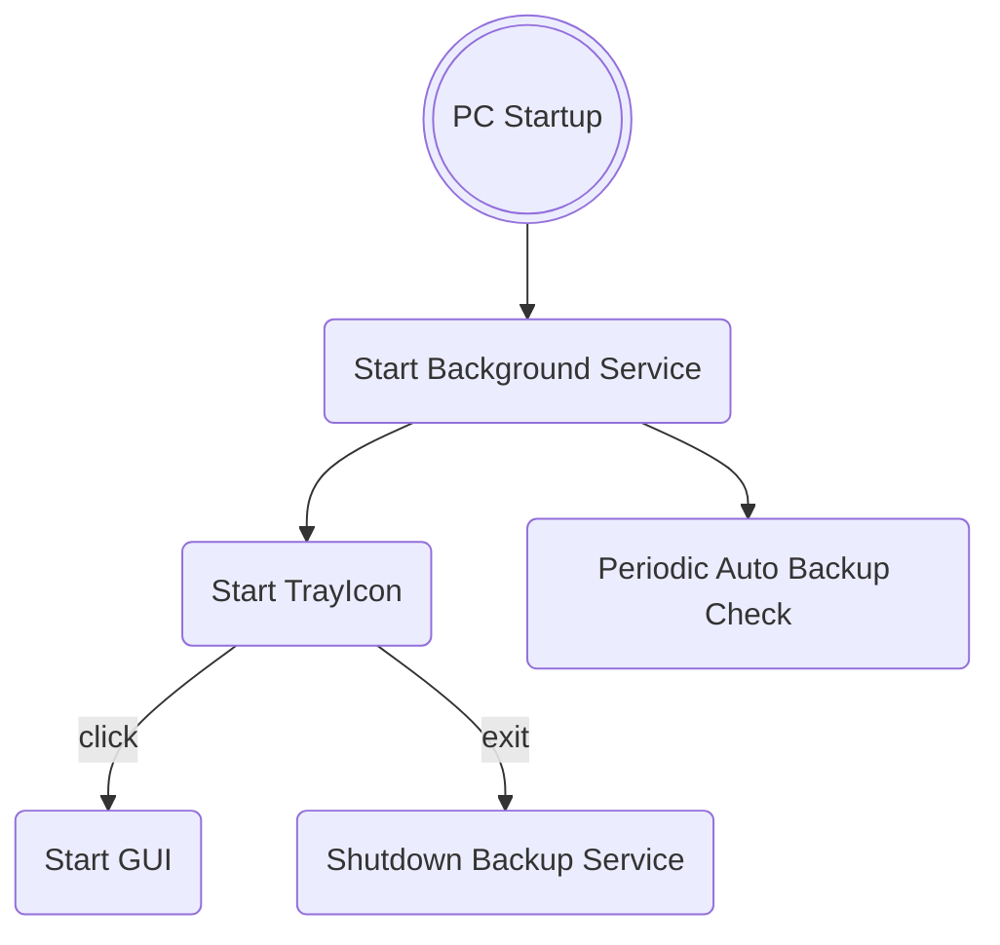

  

# Backup Manager Documentation

## Startup backgroud service Logic

## Dependecies
For this project i'm using some dependencies:
* **Flatlaf** for multi theme ([demo](https://www.formdev.com/flatlaf/#demo), [themes](https://www.formdev.com/flatlaf/themes/), [github](https://github.com/JFormDesigner/FlatLaf/tree/main/flatlaf-intellij-themes)) 
* **Gson** for manage json data
* **itextpdf** for pdf export
* **flatlaf-extras** to use svg images ([website]( https://mvnrepository.com/artifact/com.formdev/flatlaf-extras))