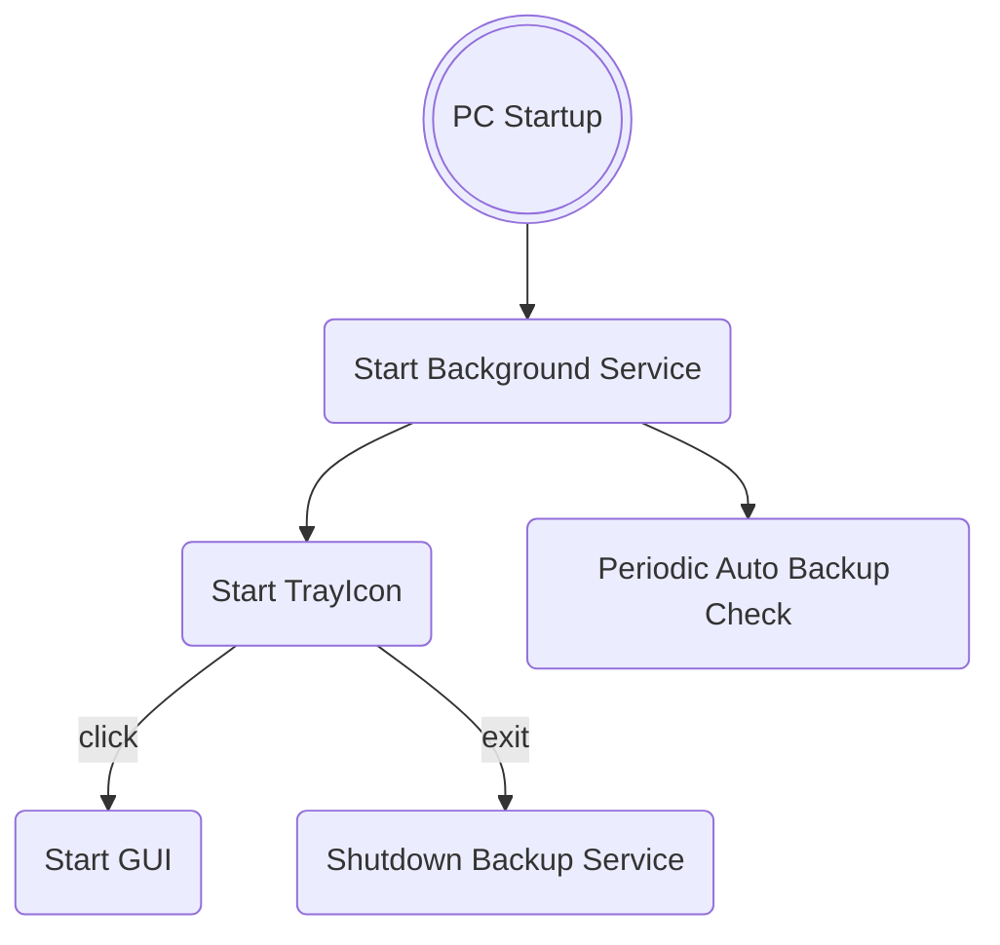

<center>  </center>

# Backup Manager Documentation

## Startup backgroud service Logic



## Link

* [SVG](https://www.svgrepo.com/)

## Dependecies

For this project i'm using some dependencies:

* **Flatlaf** for multi theme ([demo](https://www.formdev.com/flatlaf/#demo), [themes](https://www.formdev.com/flatlaf/themes/), [github](https://github.com/JFormDesigner/FlatLaf/tree/main/flatlaf-intellij-themes))
* **Gson** for manage json data
* **itextpdf** for pdf export
* **flatlaf-extras** to use svg images ([website]( https://mvnrepository.com/artifact/com.formdev/flatlaf-extras))
* **slf4j-api** and **logback-classic** for logging

## Logging

The logging system currently used is **logback**. You can check the current configuration in [CONFIG](../logback.xml).
Our logging system writes logs in console and in file .log.

### configuration

* We use "ROLLING_FILE" configuration
* Our configuration has the objective to change log file every day and keep the last 7 days of .log files:
  * During the current day, the active file will always be `logs/application.log`.
  * At midnight, the current file is renamed with the date (e.g., `application-2025-01-22.log`), and a new `application.log`  file is created.
* You can check if the current configuration works using `<configuration debug="true">`

### Enable and disable log levels

To control log types (such as enabling/disabling log levels or specific appenders) without modifying the code, you can manage them through the Logback configuration file: logback.xml.

To dynamically change the log level, edit the level value in the `<root>` tag:

```xml
<root level="debug">
    <appender-ref ref="CONSOLE" />
    <appender-ref ref="FILE" />
</root>
```

debug: Logs all messages (DEBUG, INFO, WARN, ERROR).
info: Ignores DEBUG, logs only INFO, WARN, and ERROR.
warn: Ignores DEBUG and INFO, logs only WARN and ERROR.
error: Logs only ERROR.

## Threads

### [BackgroundService](../../java/backupmanager/Services/BackupService.java)

This thread is executed only on PC startup.
It is used for

### [RunningBackupObserver](../../java/backupmanager/Services/RunningBackupObserver.java)

I need a thread that constantly checks if there are something running and i can't use a simple method calls instead because
if a backup starts caused by the BackugroundService and we open the GUI, thre are 2 different instance of this program,
so we need something like an observer that constantly checks if there are some backups in progress.
